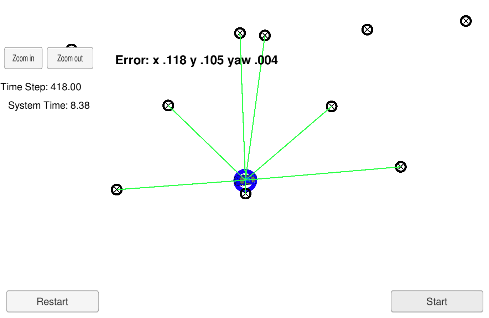
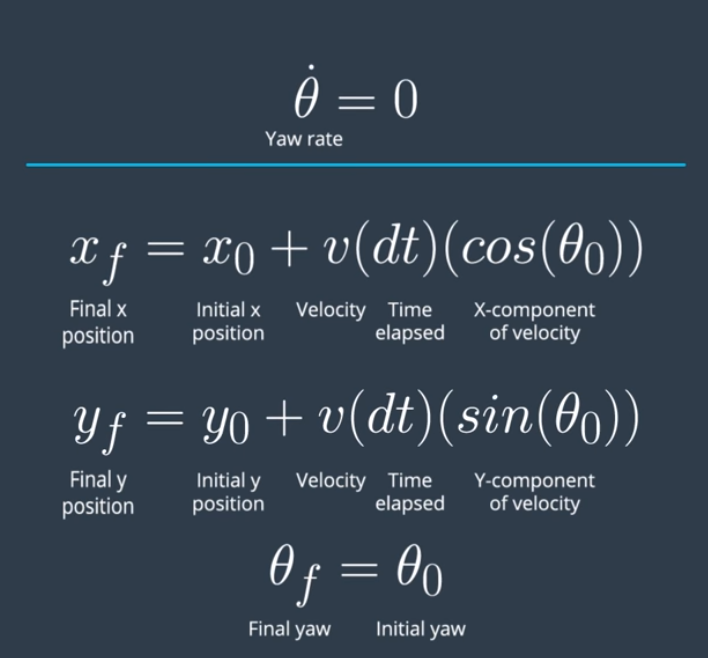
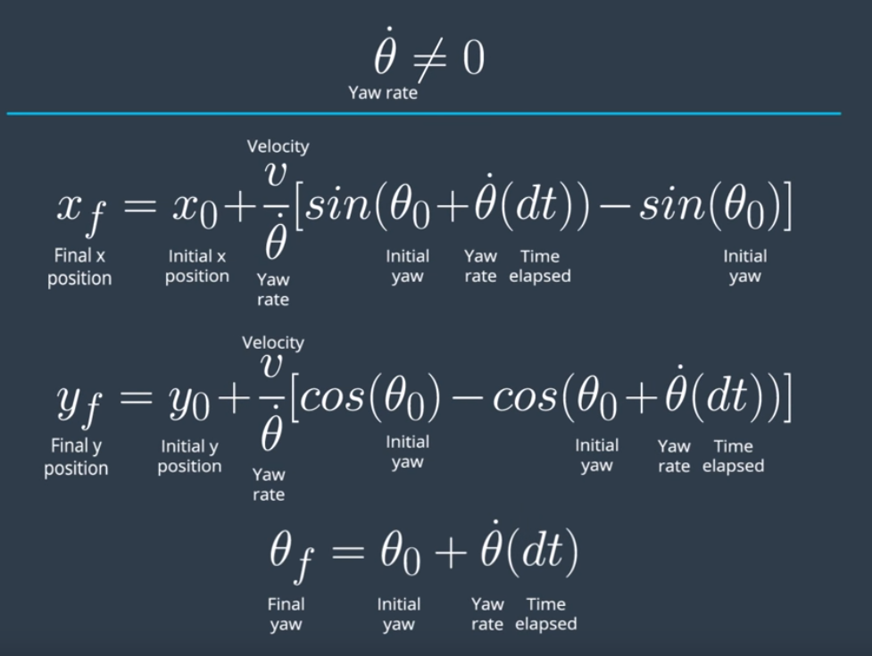
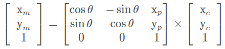
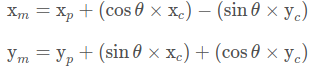
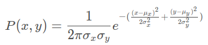

# Overview



The goal of this project is to create a particle filter to localise a vehicle relative to pre defined landmarks. The particle 
filter takes input map data of landmark locations along with noisy sensor data. These are then used to create probabilistic
inferences as to where the vehicle is located by taking a finite number of random particles and defining the likelihood that the 
robots pose is at that particle based on our inputs. The particles are then resampled until we have a high likelihood of 
the pose of the robot.

This is done by performing the following steps:

1) To initialise the robots pose we plot _N_ particles taken from a gaussian distribution with a mean of the GPS pose and a stdDev given by the GPS.

2) For each particle we predict where the robot will be assuming a bicycle model.

3) We update the weights of each particle based on the landmarks and the distance from the predicted pose of the particle.

4) We resample _N_ particles assigning a higher likeihood of picking particles with a higher weight.

5) We repeat this process.

What this eventually outputs is a tight nit cluster of particles showing the likely position of our robot. 

# Theory of Operation

### Initialisation

For the initialisation step we can use GPS to randomly distribute particles in a defined area. Whilst GPS can localise 
our robot the accuracy is poor, for example we could imagine this as drawing a circle around our vehicle that can be 
anywhere from 10's of centimeters to meters and found our localisation we want loc centimeter accuracy.

However in the case of initialisation we can utilise the GPS to create a gaussian distribution by using the pose suggested
by our GPS as the mean and the uncertainty in the measurement as our standard deviation.

From this Gaussian we can then sample random positions for each particle and initialise the weights of each particle 
to 1 which is therefore equal probability for each of our particles.

**NOTE**: This distribution only occurs on the first time stamp, after this we use the previous predicted pose.

### Prediction

Now we have a set of _N_ particles with even weights we can start to predict the motion and movement of these particles.
To do this we first assume that ego vehicle is using a bicycle model and from this can calculate our yaw rate.

If the yaw rate = 0 there we can update our particles pose with the following equations:



Else if the yaw rate is != 0:



This motion model allows us to gain an idea of where we think the particle has moved.

### Update Weights

Now we have predicted where we think our patricles are moving we now need to update the weights based upon the likelihood 
that our particle is where the robot is based upon the landmarks that are in range and the sensor measurements.

To do this we first need to compare our landmarks to our sensor observations of the landmarks. What is important to note
here is that we are using opposing coordinate frames as the landmarks are observed in the map whereas the observations
are from egos point of view, therefore we need to transform our opservations to the map coordinate frame. 

To do this we can apply the homogeneous matrix transformation:



Which can be converted to a linear equation for simplicity as:



The next step is to associate each observation with its nearest landmark and to do this we use the nearest neighbour 
technique and update the ID of the observation accordingly.

The final step is to calculate the new weight of the particle, for this we iterate over the observations and when the ID 
of the observation matches that of the Landmark we can use this to update the weight. To calculate the new weight we use
the Multivariate Gaussian Probability Function for which we fund the total product of the probabilities and then normalise
the value against the total sum of the weights.



### Resample

The final step of our filter is to resample a new set, with replacement, of particles with a set size _N_.

To do this we create a discrete distribution based on the weights of the current particles. This means that if a weight
of a certain particle is higher then we are more likely to pick it from our distribution. 

We then sample from this set at ransom to create a new distribution of particles and the whole process repeats.

The outcome of this is we have a densely nit set of particles with a high probability that shows the location of our 
robot based on measurements and landmarks.

# Usage 

To build:

```bash
cd ./Patricle_Filter_Localisation
./clean.sh # Note this script deletes the build dir
./build.sh
```

To run:

```bash
./run.sh
```

This will launch the particle filter that is expecting an input on port `4567`. To visualise the results please follow 
the instructions and download the Udacity Term 2 simulator [here](https://github.com/udacity/self-driving-car-sim/releases).


